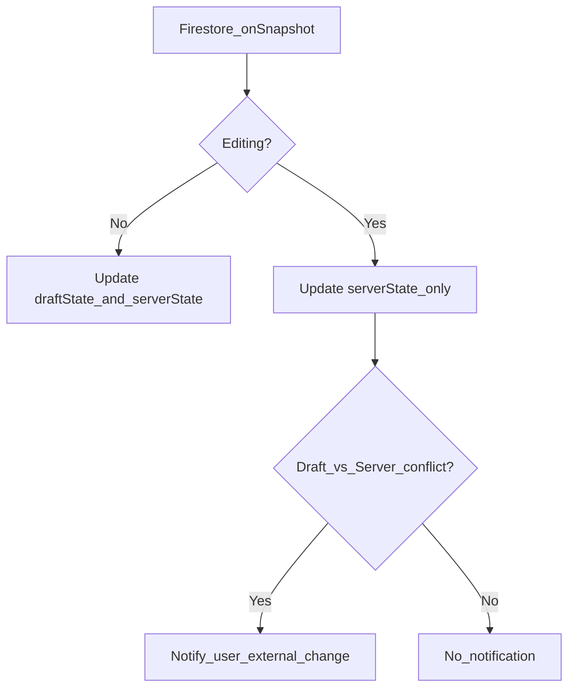

# 複数端末での同時編集によるデータ競合を防ぐための設計パターン

## 1. 問題：データの上書き（最終書き込み勝利）

複数のユーザー（または端末）が同じドキュメントを同時に編集しようとすると、データ競合が発生します。

### 典型的なシナリオ

1. **端末A** が「ドキュメントX」（例: `score: 0`, `pairings: [...]`）を読み込み、編集画面を開く。
2. **端末B** が「ドキュメントX」を読み込み、`score` を `5` に更新し、保存する（DB の最新は `score: 5`）。
3. **端末A** が（`score: 0` のデータをベースに）`pairings` を変更し、ドキュメント全体（`score: 0` を含む）で保存する。
4. **結果:** 端末A が保持していた古い `score: 0` が書き込まれ、端末B の変更（`score: 5`）が消失する。

これは「最終書き込み勝利（Last Write Wins）」と呼ばれる典型的な問題です。`setDoc(..., { merge: true })` や `updateDoc` だけでは、この問題を完全に防ぐことはできません。

---

## 2. 解決策：UI/UX と保存ロジック

この問題を解決するには、フロントエンド（UI/UX）と保存ロジック（DB 側）の両方で対策を講じるのが最も堅牢です。

### 解決策 A：UI/UX（編集中の state とサーバー state の分離）

ユーザーの編集体験を損なわずにデータの最新性を保つためのパターンです。

#### 課題
リアルタイム購読（`onSnapshot`）を行うと、他端末の変更が即座に反映され、ユーザーが編集中だった内容がリセットされてしまうことがあります。

#### 対策
「ユーザーが編集中の状態（draftState）」と「Firestore から届く最新の状態（serverState）」を別々の state として管理します。



主な考え方:

- draftState: ユーザーの編集内容を保持する state（例: react-hook-form や useState）。
- serverState: `onSnapshot` で取得する Firestore の最新データを保持する state。

リアルタイム更新ロジック:

- `onSnapshot` でデータを受信したとき、ユーザーが編集中でなければ `draftState` と `serverState` の両方を更新します。
- ユーザーが編集中（isDirty）の場合は、`draftState`（フォーム）は更新せず、`serverState` のみ更新します。これにより編集中の入力が上書きされるのを防ぎます。
- `draftState` と `serverState` を比較し、内容が異なれば（＝競合）UI 上でユーザーに「データが外部で変更された」ことを通知します。

差分の特定:

ユーザーが保存ボタンを押した際、`draftState` と `serverState` を比較し、ユーザーが本当に変更した項目だけの「差分オブジェクト」（`userEdits`）を生成して保存処理に渡します。

### 解決策 B：保存ロジック（Firestore トランザクション）

UI 側での通知だけではデータの上書きを完全に防げないため、保存処理自体を安全にする必要があります。ここでは Firestore のトランザクションを利用します。

トランザクションは「1. 読み取り」「2. マージ」「3. 書き込み」を他からの割り込みなしに実行することを保証します。

⚠️ 重要: 差分（Diff）の利用

このパターンの鍵は、クライアント（端末 A）が `userEdits` として「変更した差分のみ」を渡すことです。もし端末 A が「画面を開いた時点の古いデータ全体」を渡してしまうと、トランザクションを使ってもデータ損失（例: `score: 0` で上書き）が発生します。

したがって、**解決策 A（UI/UX）で差分を正確に特定し、それを解決策 B（Transaction）に渡す**ことが不可欠です。

#### 実装パターン（Web SDK v9, TypeScript）

```ts
import { doc, runTransaction } from "firebase/firestore";

/**
 * 競合を回避してドキュメントを安全にマージ保存する
 *
 * @param docRef 保存対象のドキュメント参照
 * @param userEdits ユーザーが編集した内容（差分のみ）
 *                 例: { pairings: [...] }
 *                 NG: { pairings: [...], score: 0 }
 */
async function safeSaveWithTransaction(docRef: any, userEdits: Record<string, any>) {
    try {
    await runTransaction(db, async (transaction) => {
        // 1. トランザクション内で最新データを取得
        const currentDoc = await transaction.get(docRef);

        if (!currentDoc.exists()) {
        throw new Error("ドキュメントが存在しません");
        }

        const latestData = currentDoc.data();

        // 2. 最新データに対して差分をマージ
        const dataToSave = {
        ...latestData, // 例: { pairings: [...], score: 5 }
        ...userEdits,  // 例: { pairings: [A の編集] }
        };

        // 3. マージ後のデータを書き込む
        transaction.set(docRef, dataToSave);
    });

    console.log("トランザクションが成功しました");
    } catch (error) {
    console.error("トランザクションが失敗しました:", error);
    // ユーザーにエラーを通知
    }
}

// --- 実行例 ---
// const docRef = doc(db, "collectionName", "docId");
// const editedFields = { pairings: [...] };
// safeSaveWithTransaction(docRef, editedFields);
```

## 3. 結論

- A (UI): 編集中のフォームを保護するために「draftState」と「serverState」を分離し、保存時に「差分」を特定する。
- B (DB): データ損失を防ぐために `runTransaction` を使い、差分を最新版にマージして書き込む。

この 2 つを組み合わせることで、安全で使いやすい編集画面を実装できます。
