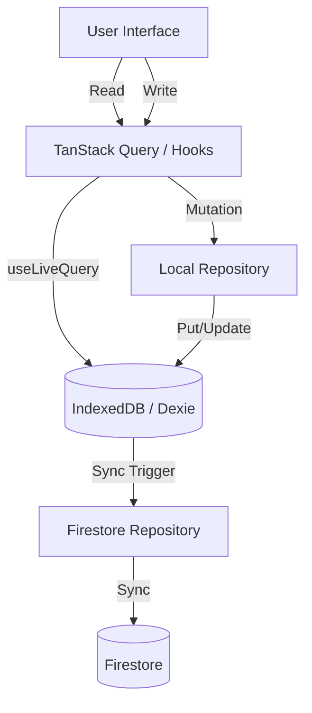

# Local-First アーキテクチャ実装ガイド

このプロジェクトでは、**Local-First (IndexedDB Primary)** アーキテクチャを採用しています。
アプリは常にローカルデータベース (IndexedDB / Dexie.js) に対して読み書きを行い、バックグラウンドまたは明示的なアクションによってクラウド (Firestore) と同期します。

## アーキテクチャ概要

1.  **Single Source of Truth (SSOT)**: クライアントアプリにとっての正解データは **IndexedDB** です。
2.  **Read**: UIは常に IndexedDB からデータを読み込みます (`useLiveQuery`)。
3.  **Write**: UIは常に IndexedDB にデータを書き込みます。書き込みは即座に反映されます。
4.  **Sync**: 書き込まれたデータは非同期に Firestore に送信されます。

## データフロー



## 実装パターン

### 1. Local Repository (IndexedDB アクセス)

`src/repositories/local` 配下に配置します。Dexie.js を使用して CRUD 操作を行います。

**必須機能:**
- **`isSynced` フラグ**: データがクラウドと同期されているかを管理します。作成・更新時は `false` に設定します。
- **論理削除 (`_deleted`)**: 削除時は物理削除せず、`_deleted: true` フラグを立て、`isSynced: false` にします。同期後に物理削除またはクラウド上の削除を行います。
- **`getUnsynced()`**: 未同期データを取得するメソッドを提供します。

```typescript
// 例: src/repositories/local/example-repository.ts
export class LocalExampleRepository {
    // 読み込み: 論理削除されていないものを返す
    async listAll() {
        return await db.examples.filter(i => !i._deleted).toArray();
    }

    // 作成: isSynced = false で保存
    async create(data: ExampleCreate) {
        const id = crypto.randomUUID();
        const item = { ...data, id, isSynced: false, _deleted: false, updatedAt: new Date() };
        await db.examples.put(item);
        return item;
    }

    // 更新: isSynced = false に戻す
    async update(id: string, changes: Partial<Example>) {
        await db.examples.update(id, { ...changes, isSynced: false, updatedAt: new Date() });
    }

    // 削除: 論理削除
    async delete(id: string) {
        await db.examples.update(id, { _deleted: true, isSynced: false, updatedAt: new Date() });
    }
}
```

### 2. Hooks / Queries (データアクセス層)

`src/queries` 配下に配置します。

- **読み込み**: `useLiveQuery` を使用してリアクティブにデータを取得します。
- **書き込み**: `useMutation` を使用して Local Repository を呼び出します。

```typescript
// 例: src/queries/use-examples.ts
export function useExamples() {
    const data = useLiveQuery(async () => {
        return await localExampleRepository.listAll();
    });
    return { data, isLoading: !data };
}

export function useCreateExample() {
    return useMutation({
        mutationFn: (data) => localExampleRepository.create(data),
        onSuccess: (newItem) => {
            // 必要に応じてここで同期処理をトリガー
            syncToCloud(newItem);
        }
    });
}
```

### 3. データ同期パターン

#### 保存フロー (Save Flow)
ユーザーが「保存」ボタンを押した際の挙動は以下の通りとします。

1.  **即時ローカル保存 (Immediate Local Save)**:
    *   データは即座に IndexedDB に保存されます。
    *   UIのローディング状態は解除され、「端末に保存しました」等のトーストが表示されます。
    *   ユーザーはすぐに次の操作に移ることができます。

2.  **バックグラウンド同期 (Background Sync)**:
    *   ローカル保存完了後、非同期で（ユーザーを待たせずに）Firestore への同期を試みます。
    *   **成功時**: 「クラウドに同期しました」等のトーストを表示し、ローカルデータの `isSynced` フラグを `true` に更新します。
    *   **失敗時 (オフライン含む)**: 「クラウドに同期失敗しました。この端末でのみ変更が反映されています。」等のトーストを表示し、ローカルデータの `isSynced` フラグは `false` のままとなります。
    *   失敗してもユーザーの作業を中断させません。

#### 同期対象と挙動の違い
*   **全コレクション (Teams, Tournaments, Matches, TeamMatches, MatchGroups)**:
    *   **保存時**: 即時ローカル保存 -> (オンライン時のみ) 自動バックグラウンド同期。
    *   **オフライン時**: ローカル保存のみ行い、同期はスキップします。「オフラインのためクラウド同期はされていません」とトーストを表示します。
    *   **オンライン時**: バックグラウンドで同期を行い、成功時に「クラウドに同期しました」とトーストを表示します。失敗時はエラー通知を行います。

#### 読み込みフロー (Read Flow)
*   `useLiveQuery` を使用して IndexedDB からデータを取得し、UI に表示します。
*   バックグラウンドで Firestore から最新データを取得し、IndexedDB を更新します（SWR的な挙動）。

### 4. 実装詳細

## チーム管理画面への適用方針

現在の `teams` 実装は Firestore を直接参照している箇所があるため、上記アーキテクチャに合わせてリファクタリングが必要です。

1.  **`LocalTeamRepository` の改修**: `isSynced`, `_deleted` の管理を追加。
2.  **`useTeams` フックの改修**: `useLiveQuery` を使用して IndexedDB から取得するように変更。